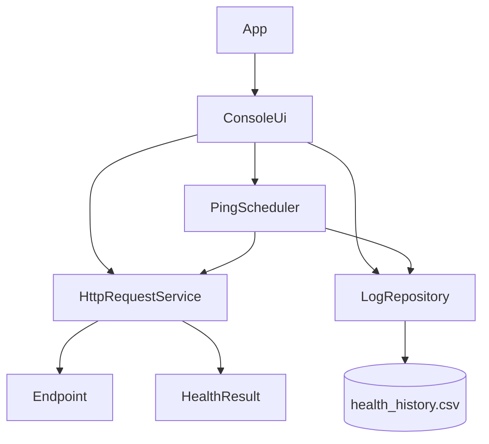
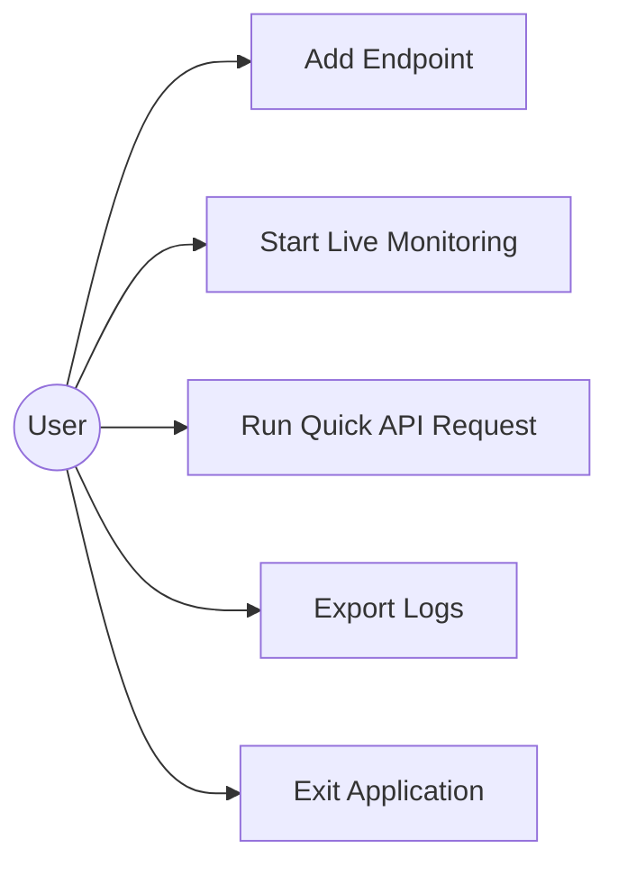
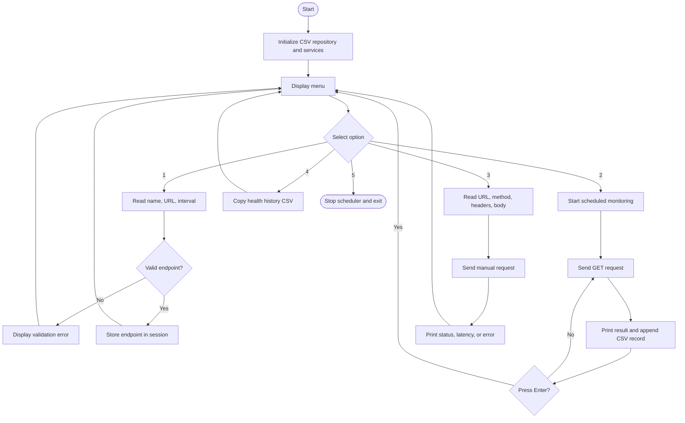
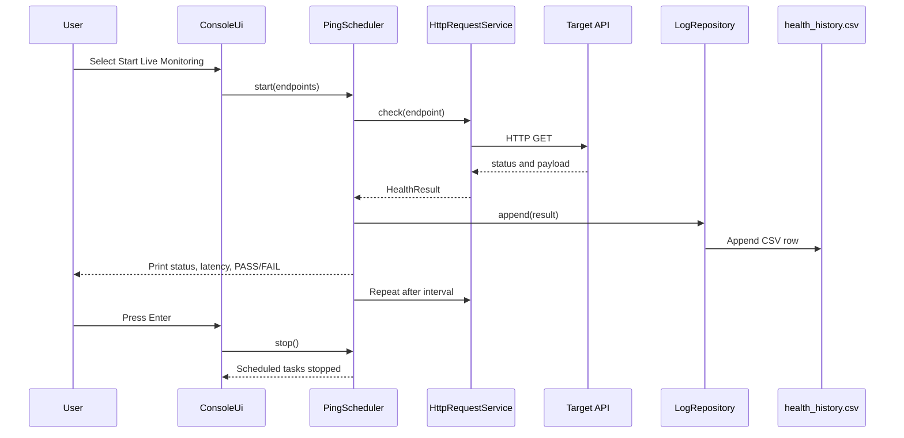
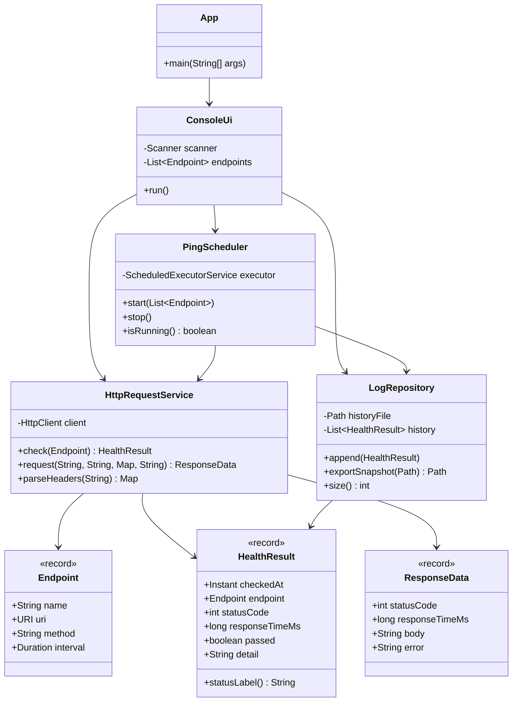
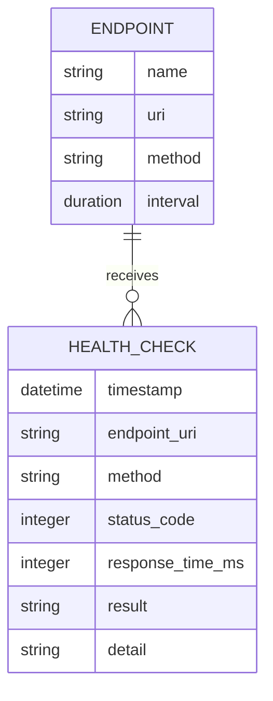

# API-Pulse CLI Project Report

**Project:** API-Pulse CLI  
**Technology:** Java 17, Maven, Java Standard Library  
**Application type:** Command-line API health monitor  
**Report date:** 18 September 2026

## 1. Cover Page

### API-Pulse CLI

A lightweight command-line application for monitoring API availability, measuring response times, running manual HTTP requests, and recording health history in CSV format.

**Prepared for:** Java application architecture and multithreading project  
**Primary focus:** Object-oriented design, HTTP communication, concurrency, exception handling, and file management

## 2. Introduction

Modern applications depend on APIs for authentication, payments, data exchange, notifications, and integrations. When an API becomes slow or unavailable, dependent services can fail or provide a poor user experience. A health monitor provides an early indication of these issues by periodically sending requests and recording the results.

API-Pulse CLI is designed as a small, fast, and understandable Java application. It provides an interactive terminal menu instead of a graphical user interface, allowing the implementation to focus on clean Java architecture and reliable background processing.

The application uses Java's built-in `java.net.http.HttpClient` for network calls, `ScheduledExecutorService` for recurring checks, ANSI escape codes for readable terminal status messages, and a local CSV file for persistent history.

## 3. Problem Statement

API availability and response performance are not always visible to a developer or operator. Manual browser checks are slow, difficult to repeat consistently, and do not automatically preserve historical evidence. A monitoring tool is needed to:

- Register API endpoints and check them repeatedly.
- Display HTTP status codes and response latency.
- Identify successful responses, HTTP errors, timeouts, and network failures.
- Run manual GET and POST tests with custom headers.
- Preserve monitoring results for later review.
- Continue operating after individual request failures instead of terminating the CLI session.

## 4. Functional Requirements

| ID | Requirement | Implementation |
|---|---|---|
| FR-01 | Display an interactive terminal menu. | `ConsoleUi` provides options for registration, monitoring, request testing, export, and exit. |
| FR-02 | Register API endpoints. | Endpoint name, URL, and interval are collected from the user. |
| FR-03 | Validate endpoint configuration. | `Endpoint` validates the name, URI, GET method, and positive interval. |
| FR-04 | Monitor endpoints periodically. | `PingScheduler` schedules one recurring task per endpoint. |
| FR-05 | Execute health requests. | `HttpRequestService.check()` sends GET requests with `HttpClient`. |
| FR-06 | Display status and latency. | The scheduler prints status code, response time, and PASS/FAIL using ANSI colors. |
| FR-07 | Run manual GET and POST requests. | The quick request flow accepts a URL, method, headers, and optional POST body. |
| FR-08 | Display response payloads. | Successful manual requests print the status, latency, and response body. |
| FR-09 | Persist health history. | `LogRepository` appends timestamped results to `health_history.csv`. |
| FR-10 | Export logs. | The application copies the current history file to `health_history_export.csv`. |
| FR-11 | Handle request failures. | Invalid URLs, timeouts, and other exceptions become readable failure details. |
| FR-12 | Stop monitoring cleanly. | Pressing Enter stops scheduled checks; try-with-resources closes the scheduler. |

## 5. Non-functional Requirements

| Category | Requirement | Design response |
|---|---|---|
| Performance | Monitoring should avoid blocking the menu thread. | Endpoint checks run on scheduled worker threads. |
| Reliability | A single network failure must not crash the session. | Request exceptions are converted to `HealthResult` or `ResponseData` errors. |
| Maintainability | Responsibilities should be separated. | Models, services, monitoring, persistence, and UI use separate packages. |
| Portability | The project should run without third-party runtime libraries. | Only Java 17 standard APIs are used. |
| Usability | Results should be easy to scan in a terminal. | Status colors, timestamps, response codes, latency, and labels are printed. |
| Data durability | Health results should survive application restarts. | Results are appended to a local CSV file. |
| Simplicity | The project should be understandable for learners. | Small classes and direct control flow are used instead of a complex framework. |
| Security baseline | User-provided URLs and headers should be passed through standard HTTP APIs. | `HttpRequest` and `HttpClient` construct and send requests without shell execution. |

## 6. System Architecture

API-Pulse CLI follows a layered architecture:

- **Presentation layer:** `ConsoleUi` handles prompts, menu navigation, and terminal output.
- **Application entry point:** `App` creates and connects the services.
- **Monitoring layer:** `PingScheduler` manages recurring background checks.
- **Service layer:** `HttpRequestService` performs health and manual HTTP requests.
- **Domain model:** `Endpoint` and `HealthResult` represent application data.
- **Persistence layer:** `LogRepository` writes and exports CSV history.



### Runtime flow

1. `App` creates the repository, HTTP service, scheduler, and console.
2. `ConsoleUi` collects commands from the user.
3. A monitoring request passes endpoint configurations to `PingScheduler`.
4. The scheduler starts a recurring task for every endpoint.
5. Each task calls `HttpRequestService.check()`.
6. The result is printed and appended by `LogRepository`.
7. The user presses Enter to stop monitoring.

## 7. Design Diagrams

### 7.1 Use Case Diagram



### 7.2 Workflow Diagram



### 7.3 Sequence Diagram: Scheduled Health Check



### 7.4 Class/Component Diagram



### 7.5 ER Diagram

The project uses a CSV file rather than a relational database. The following logical ER-style diagram represents one CSV row and its relationship to an endpoint.



The physical storage format is the CSV header:

```text
timestamp,endpoint,method,status_code,response_time_ms,result,detail
```

## 8. Design Decisions & Rationale

### Java standard library only

The project uses `HttpClient`, records, NIO file APIs, and concurrency utilities from Java 17. This reduces setup overhead and demonstrates core Java capabilities directly.

### Records for data models

`Endpoint`, `HealthResult`, and `ResponseData` are records because they primarily carry immutable data. Records reduce boilerplate while preserving clear field names and accessor methods.

### Scheduled executor for monitoring

`ScheduledExecutorService` is suitable for repeated work at fixed intervals. A separate scheduled task is created for each endpoint, allowing checks to run concurrently instead of waiting for one endpoint to finish before starting another.

### CSV instead of a database

CSV is appropriate for a lightweight local tool. It is human-readable, easy to export, and requires no database server or additional driver dependency. The trade-off is that it is less suitable for high-volume analytics or concurrent multi-user access.

### Synchronous HTTP calls inside worker threads

The Java HTTP client sends requests synchronously, but the calls are made by scheduler worker threads rather than the interactive menu thread. This keeps the implementation simple while preventing a slow API from freezing menu interaction during monitoring.

### Centralized error conversion

Network and URL exceptions are converted into readable result details. This keeps exception handling close to the HTTP boundary and gives the UI a stable result structure to display.

### ANSI status colors

Green is used for successful results and red for failures. ANSI codes improve readability while remaining simple and dependency-free. Terminals that do not support ANSI may display the escape codes as plain text.

## 9. Implementation Details

### Package structure

```text
src/main/java/com/apipulse/
|-- App.java
|-- model/
|   |-- Endpoint.java
|   `-- HealthResult.java
|-- monitor/
|   `-- PingScheduler.java
|-- repository/
|   `-- LogRepository.java
|-- service/
|   `-- HttpRequestService.java
`-- ui/
    `-- ConsoleUi.java
```

### HTTP communication

`HttpRequestService` creates an `HttpClient` with a 10-second connection timeout and normal redirect handling. Health checks use a 15-second request timeout, while manual requests use a 20-second timeout. A response with a status from 200 through 399 is classified as PASS for monitoring.

### Concurrency

`PingScheduler` creates a scheduled thread pool sized to the number of registered endpoints, with at least one worker. `scheduleAtFixedRate()` runs the first check immediately and repeats according to the endpoint interval.

### Persistence

`LogRepository` creates the CSV header when necessary and appends one row per result. File writes are synchronized so scheduled workers do not interleave CSV writes. The repository also keeps an in-memory count for the export message.

### Input handling

The console accepts comma-separated headers in the form `Name: Value`. For POST requests, the entered body is sent as the request payload. Unsupported methods are rejected by the console flow.

### Build and execution

With Maven:

```text
mvn compile exec:java
```

With the JDK on PowerShell:

```powershell
New-Item -ItemType Directory -Force out | Out-Null
javac -d out (Get-ChildItem -Recurse src/main/java -Filter *.java | Select-Object -ExpandProperty FullName)
java -cp out com.apipulse.App
```

## 10. Screenshots / Results

### Terminal result

The application presents a menu similar to the following:

```text
=== API HEALTH PULSE CLI ===
1. Add Endpoint
2. Start Live Monitoring
3. Quick API Request Test
4. Export Logs to File
5. Exit
Select option:
```

During monitoring, status lines use this format:

```text
[22:04:36] GET https://google.com | 200 OK | 882 ms | PASS
```

ANSI color behavior:

- Green: successful HTTP response and `PASS`.
- Red: HTTP error, timeout, invalid URL, or network failure and `FAIL`.

### Observed CSV results

The existing `health_history.csv` contains successful monitoring samples. The observed records include:

| Endpoint | Status | Response time | Result |
|---|---:|---:|---|
| `https://google.com` | 200 | 882 ms | PASS |
| `https://google.com` | 200 | 361 ms | PASS |
| `https://google.com` | 200 | 284 ms | PASS |
| `https://google.com` | 200 | 279 ms | PASS |
| `https://google.com` | 200 | 306 ms | PASS |

These results demonstrate that the monitor records timestamps, endpoint URLs, status codes, latency, result labels, and details in CSV format.

## 11. Testing Approach

Testing is based on compilation, diagnostics, controlled CLI input, and real HTTP monitoring.

| Test area | Test case | Expected result |
|---|---|---|
| Compilation | Compile all files with Java 17 `javac`. | No compiler errors. |
| Application startup | Start `com.apipulse.App`. | Menu is displayed. |
| Endpoint validation | Enter a blank name or non-positive interval. | Validation error is displayed and the menu continues. |
| Invalid URL | Run a manual request with invalid URL text. | `Invalid URL` is displayed and the CLI remains active. |
| GET request | Submit a reachable URL with GET. | Status code, latency, and body are displayed. |
| POST request | Submit a URL, headers, and body with POST. | Response status and payload are displayed. |
| Monitoring | Register an endpoint and start monitoring. | Checks run repeatedly on a background scheduler. |
| Persistence | Complete one or more health checks. | Rows are appended to `health_history.csv`. |
| Export | Select the export option. | `health_history_export.csv` is created or replaced. |
| Shutdown | Press Enter during monitoring and select Exit. | Scheduler stops and the application terminates cleanly. |

A previously executed invalid URL smoke test produced the expected behavior: the application printed `Request failed: Invalid URL`, returned to the menu, and then exited normally when option 5 was selected.

## 12. Challenges Faced

### PowerShell source expansion

Passing `Get-ChildItem` directly to `javac` caused a `file not found: App.java` error because PowerShell supplied file names without the complete paths. The reliable command expands `FullName` before passing the files to `javac`.

### Network unpredictability

External APIs can be slow, unavailable, rate-limited, or affected by local connectivity. The implementation therefore uses timeouts and converts exceptions into health results rather than allowing a request failure to end the application.

### Concurrent file writes

Several scheduled workers may complete checks at similar times. `LogRepository.append()` is synchronized so each CSV row is written as one protected operation.

### Cross-platform terminal styling

ANSI escape sequences improve output on compatible terminals but are not interpreted by every console. The application keeps styling optional at the output level and does not depend on it for correctness.

### Keeping the UI simple

A CLI requires careful prompt sequencing because input is line-based. The menu keeps each interaction short and returns to a known state after successful or failed operations.

## 13. Learnings & Key Takeaways

- Java's standard library is sufficient for a useful network monitoring tool.
- Scheduled executors provide a clean abstraction for recurring background work.
- Separating models, services, monitoring, persistence, and UI makes the code easier to understand and test.
- Timeouts are essential for network applications because remote systems are outside the program's control.
- Records are effective for compact immutable result objects.
- Persistent CSV output provides useful audit history with very little infrastructure.
- User-facing error messages should be understandable without exposing internal stack traces.
- Build commands need to account for shell-specific behavior, especially when compiling source files from PowerShell.

## 14. Future Enhancements

- Support configurable HTTP methods and request bodies for monitored endpoints.
- Add endpoint update and delete operations.
- Load registered endpoints from a configuration file at startup.
- Add command-line arguments for non-interactive monitoring.
- Add retry policies and exponential backoff for temporary failures.
- Add response body validation, such as expected JSON fields or text markers.
- Add configurable request headers and authentication profiles.
- Rotate or archive large CSV history files.
- Add a database repository implementation for larger deployments.
- Add automated unit and integration tests using a local mock HTTP server.
- Add metrics such as uptime percentage, average latency, and percentile latency.
- Add structured JSON logging and optional file-based alert notifications.
- Provide an option to disable ANSI colors for redirected output.

## 15. References

1. Oracle Java Documentation, `java.net.http.HttpClient`: https://docs.oracle.com/en/java/javase/17/docs/api/java.net.http/java/net/http/HttpClient.html
2. Oracle Java Documentation, `java.net.http.HttpRequest`: https://docs.oracle.com/en/java/javase/17/docs/api/java.net.http/java/net/http/HttpRequest.html
3. Oracle Java Documentation, `java.util.concurrent.ScheduledExecutorService`: https://docs.oracle.com/en/java/javase/17/docs/api/java.base/java/util/concurrent/ScheduledExecutorService.html
4. Oracle Java Documentation, `java.nio.file.Files`: https://docs.oracle.com/en/java/javase/17/docs/api/java.base/java/nio/file/Files.html
5. Oracle Java Documentation, Java records: https://docs.oracle.com/en/java/javase/17/language/records.html
6. Apache Maven documentation: https://maven.apache.org/guides/
7. Project source code and runtime CSV output in this repository.
